<div align="center">
  
  <h1>SamoAI</h1>
  <p><em>A multi-agent narrative layer that helps humans and AI communicate and collaborate naturally</em></p>
</div>

<p align="center">
  <a href="#-what-is-samoai">What is SamoAI</a> •
  <a href="#-core-concepts">Core Concepts</a> •
  <a href="#-products">Products</a> •
  <a href="#-getting-started">Getting Started</a> •
  <a href="#-license">License</a>
</p>



```mermaid
flowchart TD
  %% ── Styles ────────────────────────────────────────────────
  classDef location fill:#FFF5EE,stroke:#FF9248,stroke-width:2px;
  classDef user     fill:#E8F8F5,stroke:#16A085,stroke-width:1px;
  classDef agentbox fill:#EEF5FF,stroke:#2980B9,stroke-width:1px;
  classDef inner    fill:#FFFFFF,stroke:#2980B9,stroke-width:0.5px;
  classDef canvas   fill:#E8FFF5,stroke:#16A085,stroke-width:1px;
  classDef gimmick  fill:#FDF2FF,stroke:#9B59B6,stroke-width:1px;
  classDef external fill:#F9F9F9,stroke:#7F8C8D,stroke-dasharray:3 3;
  classDef engine   fill:#FFFFF0,stroke:#7F8C8D,stroke-dasharray:2 2;

  %% ── Location ─────────────────────────────────────────────
  subgraph L["Location"]
    direction TB

    %% Users (compact)
    subgraph UsersGrp["Users"]
      direction LR
      U1["User"]:::user
      U2["User"]:::user
    end

    %% Agents (two examples)
    subgraph AgentsGrp["Agents"]
      direction LR

      %% Agent 2 – Nyx
      subgraph A2["<img src='https://raw.githubusercontent.com/little-samo/SamoAI/master/docs/static/img/nyx_mascot.png' height='70px'/><br/>Agent"]
        direction TB
        P2["Persona"]:::inner
        M2["Memory"]:::inner
        S2["Summary"]:::inner
        C2["Personal&nbsp;Canvas"]:::inner
        Engines2["GPT&nbsp;|&nbsp;Gemini&nbsp;|&nbsp;Claude"]:::engine
      end
      class A2 agentbox

      %% Agent 1 – Samo
      subgraph A1["<img src='https://raw.githubusercontent.com/little-samo/SamoAI/master/docs/static/img/samo_mascot.png' height='45px'/><br/>Agent"]
        direction TB
        P1["Persona"]:::inner
        M1["Memory"]:::inner
        S1["Summary"]:::inner
        C1["Personal&nbsp;Canvas"]:::inner
        Engines1["GPT&nbsp;|&nbsp;Gemini&nbsp;|&nbsp;Claude"]:::engine
      end
      class A1 agentbox
    end

    %% Collaboration hub
    subgraph Collab["Collaboration"]
      direction LR
      SharedCanvas["Shared&nbsp;Canvas<br/>(Docs)"]:::canvas
      Messages["Messages<br/>(Chat)"]:::canvas
    end

    %% Gimmicks
    Gimmicks["Gimmicks<br/>(Web Search, SNS Posts, …)"]:::gimmick
  end
  style L fill:#FFF5EE,stroke:#FF9248,stroke-width:2px

  %% External services
  External["External Services<br/>(Web, SNS, Games, Banking)"]:::external

  %% ── Relationships (5 arrows) ─────────────────────────────
  UsersGrp  -- "chat & edit" --> Collab
  AgentsGrp -- "chat & edit" --> Collab
  UsersGrp  -- "request"     --> Gimmicks
  AgentsGrp -- "trigger"     --> Gimmicks
  Gimmicks  -- "invoke"      --> External

  %% Multiple locations note
  L -. "Multiple locations" .-> L2["…"]
```

## 🌟 What is SamoAI

SamoAI creates a seamless multi-agent narrative layer between humans and AI, enabling natural collaboration across multiple platforms. Through consistent identity preservation and contextual memory, it allows interactions that evolve over time through chains of actions, just like human relationships.

## 🧠 Core Concepts

<table>
  <tr>
    <td width="33%" align="center"><b>🌍 Narrative Space</b></td>
    <td width="33%" align="center"><b>👤 Agent Identity</b></td>
    <td width="33%" align="center"><b>🤝 Organizational Collaboration</b></td>
  </tr>
  <tr>
    <td>
      Virtual environments implemented as "Locations" with unique rules and contexts. Experiences flow seamlessly across platforms while maintaining consistent identity.
    </td>
    <td>
      Unified Entity system where AI and humans interact as equals. Includes Agents, Users, and Gimmicks with distinctive appearance, personality, background, and speech patterns.
    </td>
    <td>
      Systematic interaction through structured Actions supporting role-based activities. Features action chaining for complex workflows and contextual understanding for efficient collaboration.
    </td>
  </tr>
  <tr>
    <td width="33%" align="center"><b>🧿 Adaptive Memory</b></td>
    <td width="33%" align="center"><b>🔌 LLM Integration</b></td>
    <td width="33%" align="center"><b>🧩 Flexible Extensibility</b></td>
  </tr>
  <tr>
    <td>
      Short/long-term memory systems with distinct personal and relational memory types. Features canvas workspaces for knowledge sharing and summary mechanisms to compress experiences.
    </td>
    <td>
      Seamless connection to multiple LLM platforms (Claude, Gemini, etc.). Currently leverages Claude for complex reasoning and Gemini for quick multimodal responses with customized prompting per model.
    </td>
    <td>
      Three-dimensional expansion via plugin architecture: spatial environments (new Locations), entity types (Agent variations), and external system connections through Model Context Protocol integration.
    </td>
  </tr>
</table>

## 💡 Products

### 🎮 AI Plays

<div align="center">
  <a href="https://youtu.be/OKqeb6rp_zE?feature=shared" target="_blank">
    
  </a>
  <br>
  <div>
    <a href="https://www.youtube.com/@TeamSamoAI" target="_blank">
      
    </a>
    &nbsp;&nbsp;
    <a href="https://twitch.tv/samo_ai" target="_blank">
      
    </a>
  </div>
</div>

AI agents playing games while interacting with viewers in real-time:

- **PoC**: Pokémon Red/Blue featuring Samo and Nyx AI VTubers in collaborative play
- Maintains consistent personality across Twitch gameplay and SNS(X, Telegram, etc.) interactions
- Remembers viewer interactions across platforms to build genuine relationships
- Expanding into role-based multi-agent collaborative gameplay across various genres

### 💼 AI Teams

Virtual teams of AI agents collaborating with specialized roles:

- **PoC**: Game design team simulation from concept to design documents
- AI agents in PM, writer, designer, and developer roles work together
- Maintains context across collaboration tools (Slack, Notion, email)
- Preserves project history and decision reasoning for long-term consistency
- Potential B2B solutions for productivity enhancement and human-AI hybrid teams

## 🛠️ Getting Started

```bash
# Using npm
npm install --save @little-samo/samo-ai

# Using yarn
yarn add @little-samo/samo-ai
```

## 📝 Example

Check out our example CLI application:

[SamoAI-Example-CLI](https://github.com/little-samo/SamoAI-Example-CLI) - A command-line interface for interacting with SamoAI agents.

<div align="center">
  
</div>

## 📜 License

[MIT License](LICENSE)

---

<div align="center">
  <p>Made with ❤️ by the SamoAI Team</p>
</div>
